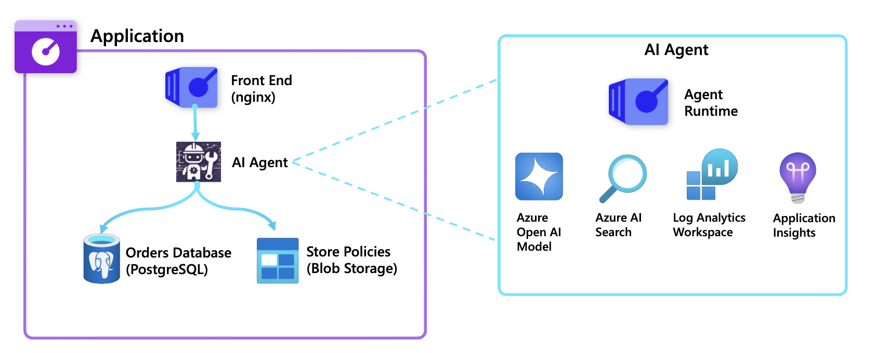
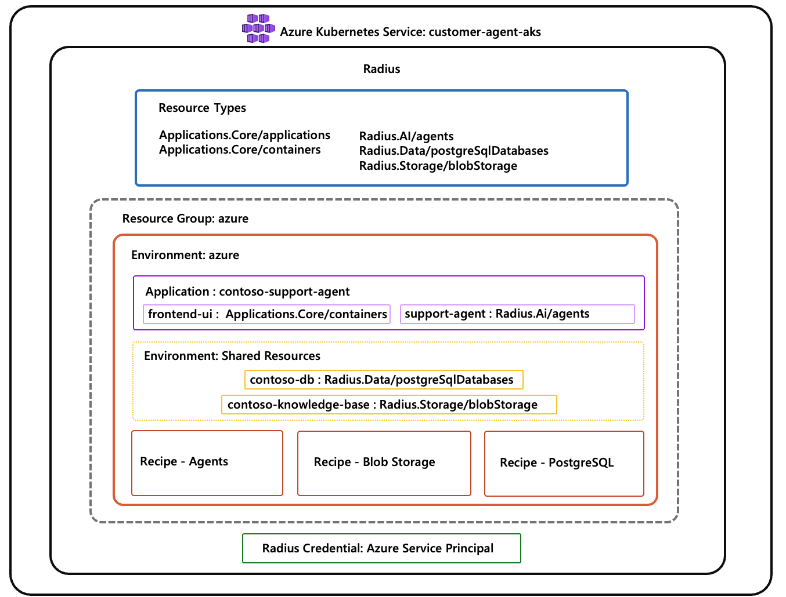

# Radius Customer Support Agent

This sample demonstrates how to build and deploy an **agentic AI application** using [Radius](https://radapp.io), an open-source application platform that enables developers and platform engineers to define, deploy, and manage cloud-native applications across any infrastructure.

## Why Radius?

Building AI applications today is hard. A developer who wants to build an AI agent goes through the toil of understanding infrastructure dependencies like Azure OpenAI deployments, configuring AI Search indexes, setting up managed identities with the right RBAC roles, provisioning storage accounts and more over conforming to the requirements of the enterprise. This creates a high barrier to entry for developers and slows down innovation.

Radius solves this by enabling **platform engineers** to define abstract, application-oriented **Resource Types** and, separately, **Recipes** which implement those Resource Types using Infrastructure as Code (IaC). The developer just declares what application resources(an AI agent, a database, a frontend) they need in an application definition and Radius handles the deployment of the resources.

## Customer Support Agent Application

This sample is a customer support agent application for the fictional **Contoso Online Store**. Unlike a simple chatbot, this agent autonomously reasons about customer requests, decides which tools to use, takes actions (like cancelling orders or initiating returns), and chains multiple operations together.  It uses several Azure services including [Azure OpenAI](https://learn.microsoft.com/azure/ai-services/openai/).

Below is a high-level architecture diagram of the application

<p align="center">
  
</p>

At the completion of this walkthrough, the application and Radius configuration will look like:

<p align="center">
  
</p>

## 📁 Repository structure

```
├── knowledge-base/          # Contoso policy PDFs for RAG
├── scripts/setup-azure.sh   # One-command Azure prerequisite setup
├── src/
│   ├── agent-runtime/       # Agentic backend (FastAPI + OpenAI tool calling)
│   └── web/                 # Chat UI frontend (nginx)
└── radius/
    ├── app.bicep             # Application definition (what the developer writes)
    ├── env.bicep             # Environment + shared resources
    ├── types/                # Custom resource type schemas (AI, Data, Storage)
    ├── extensions/           # Generated Bicep extensions (.tgz)
    └── recipes/              # IaC templates (agent, postgres, blobstorage)
```

## 🎯 Goals

By the end of this walkthrough, you will:

- Understand the Radius concepts of **Resource Types**, **Recipes**, **Environments**, and **Applications**
- See how custom abstractions (like `Radius.AI/agents`) simplify the developer experience building agentic applications
- Deploy a fully functional agentic AI application to Azure with Radius

## ✅ Prerequisites

Before you begin, you need:

- An Azure subscription
- [Azure CLI](https://learn.microsoft.com/cli/azure/install-azure-cli) installed
- [Radius CLI](https://docs.radapp.io/tutorials/install-radius/#install-the-radius-cli) installed
- [kubectl](https://kubernetes.io/docs/tasks/tools/#kubectl) installed

> [!TIP]
> This walkthrough uses Bash syntax. On Windows, use one of:
>
> - WSL (recommended)
> - Git Bash
> - Azure Cloud Shell
>
> PowerShell users can follow along with minor syntax adjustments (examples provided where needed).

---

## 🚀 Walkthrough

### Step 1: Clone the repository

```bash
git clone https://github.com/radius-project/lab.git
cd lab/001-customer-support-agent/
```

### Step 2: Set up prerequisites in Azure

Run the setup script to create an Azure resource group, AKS cluster, service principal, and register the resource providers required for this application:

**Bash**

```bash
./scripts/setup-azure.sh --location westus3 --resource-group customer-agent --cluster-name customer-agent-aks
```

**PowerShell**

```powershell
bash ./scripts/setup-azure.sh --location westus3 --resource-group customer-agent --cluster-name customer-agent-aks
```

> [!NOTE]
> This takes a few minutes (mostly AKS cluster creation).
>
> - `--resource-group <name>` name of the resource group to create. The script will create one if it doesn't exist. Defaults to `customer-agent`.
> - `--location <region>` region for the resource group and AKS cluster. Defaults to `westus3`.
> - `--cluster-name <your-cluster-name>` name of the AKS cluster. The script will detect it and skip creation if it already exists. Defaults to `customer-agent-aks`.

The script will output the next steps. Service principal credentials are saved to `.azure-sp.env` for use in the next step.

<details>
<summary>What the script does (click to expand)</summary>

1. Registers required Azure resource providers (Storage, PostgreSQL, ContainerInstance, OperationalInsights, Search, CognitiveServices)
2. Creates a resource group
3. Creates an AKS cluster with 1 node (`Standard_B2as_v2`)
4. Creates a service principal with "Owner" role scoped to the resource group
5. Saves credentials to `.azure-sp.env`

</details>

### Step 3: Install Radius on the AKS cluster

Verify the current `kubectl` context is set to the AKS cluster created in the previous step:

```bash
kubectl config current-context
```

Install Radius in your AKS cluster:

```bash
rad install kubernetes
```

Verify the installation:

```bash
kubectl get pods -n radius-system
```

You should see all Radius pods running:

```
NAME                READY   STATUS    RESTARTS   AGE
applications-rp      1/1     Running   0          1m
bicep-de             1/1     Running   0          1m
contour-contour      1/1     Running   0          1m
contour-envoy        1/1     Running   0          1m
controller           1/1     Running   0          1m
dashboard            1/1     Running   0          1m
dynamic-rp           1/1     Running   0          1m
ucp                  1/1     Running   0          1m
```

### Step 4: Authenticate Radius to Azure

Register the Azure credential using the service principal from Step 2:

**Bash**

```bash
source .azure-sp.env && rad credential register azure sp \
  --client-id $AZURE_CLIENT_ID \
  --client-secret $AZURE_CLIENT_SECRET \
  --tenant-id $AZURE_TENANT_ID
```

**PowerShell**

```powershell
Get-Content .azure-sp.env | ForEach-Object {
  $name, $value = $_ -split '=', 2
  Set-Item -Path Env:$name -Value $value
}

rad credential register azure sp `
  --client-id $env:AZURE_CLIENT_ID `
  --client-secret $env:AZURE_CLIENT_SECRET `
  --tenant-id $env:AZURE_TENANT_ID
```

Verify the credential is registered:

```bash
rad credential list
```

```
PROVIDER  REGISTERED
azure     true
```

### Step 5: Create the Resource Types required by the application

Resource Types are abstract application resources that are infrastructure/cloud provider-agnostic. They define the properties that developers can set when they declare resources in their `app.bicep`, and they map to recipes that provision the underlying infrastructure

Register all three types with Radius:

```bash
rad resource-type create -f radius/types/agent.yaml
rad resource-type create -f radius/types/postgreSqlDatabases.yaml
rad resource-type create -f radius/types/blobStorages.yaml
```

Each type definition in `radius/types/` is a YAML file that declares:

- A **namespace and type name** (e.g., `Radius.AI/agents`)
- A **schema** describing the properties developers can set (like `prompt`, `model`, `enableObservability`)
- **Read-only properties** that recipes output back (like `agentEndpoint`)

For example, `radius/types/agent.yaml` defines the `Radius.AI/agents` type. A developer using this type only needs to specify a prompt and model name — they don't need to know that behind the scenes, the recipe provisions 8 Azure resources with role assignments and networking.

You can verify the types were created:

```bash
rad resource-type list
```

```
TYPE                                    NAMESPACE                APIVERSION
Applications.Core/applications          Applications.Core        ["2023-10-01-preview"]
...
Radius.AI/agents                        Radius.AI                ["2025-08-01-preview"]
Radius.Data/postgreSqlDatabases         Radius.Data              ["2025-08-01-preview"]
Radius.Storage/blobStorages             Radius.Storage           ["2025-08-01-preview"]
```

<details>
<summary>Learn about Bicep extensions (click to expand)</summary>

Bicep extensions are needed for each Resource Type to provide type safety and autocompletion in VS Code (when the Bicep extension is installed). These extensions are defined in the `bicepconfig.json` file. As part of this sample, a preconfigured `bicepconfig.json` referencing the pre-generated Bicep extensions in the `radius/extensions/` directory is provided. No action needed.

If you modify a Resource Type definition, you must regenerate its extension:

```bash
rad bicep publish-extension -f radius/types/agent.yaml --target radius/extensions/radiusai.tgz
rad bicep publish-extension -f radius/types/postgreSqlDatabases.yaml --target radius/extensions/radiusdata.tgz
rad bicep publish-extension -f radius/types/blobStorages.yaml --target radius/extensions/radiusstorage.tgz
```
</details>

### Step 6: Create the Radius Environment

A Radius Environment is where you configure *which* recipes to use and *where* Azure resources should be provisioned. Just like Azure, all Radius resources are created in a Radius resource group.

Create a Radius resource group

```bash
rad group create azure
```

Now deploy the environment. This will create the environment and register the recipes that define how to provision the Resource Types you created in the previous step.

**Bash**

```bash
source .azure-sp.env && rad deploy radius/env.bicep --group azure \
  --parameters azureSubscriptionId=$AZURE_SUBSCRIPTION_ID \
  --parameters azureResourceGroup=$AZURE_RESOURCE_GROUP
```

**PowerShell**

```powershell
Get-Content .azure-sp.env | ForEach-Object {
  $name, $value = $_ -split '=', 2
  Set-Item -Path Env:$name -Value $value
}

rad deploy radius/env.bicep --group azure `
  --parameters azureSubscriptionId=$env:AZURE_SUBSCRIPTION_ID `
  --parameters azureResourceGroup=$env:AZURE_RESOURCE_GROUP
```

### Step 7: Create a workspace and understand the environment configuration

Create a workspace so the `rad` CLI knows which environment and group to use by default:

**Bash**

```bash
rad workspace create kubernetes azure \
  --context $(kubectl config current-context) \
  --environment azure \
  --group azure
```

**PowerShell**

```powershell
rad workspace create kubernetes azure `
  --context (kubectl config current-context) `
  --environment azure `
  --group azure
```

Confirm the environment was created from the previous step::

```bash
rad environment show -o json
```

Now lets look at the recipes added to the environment. A Recipe defines *how* to provision a Resource Type. Recipes are Infrastructure as Code templates, Bicep in this sample, that Radius executes when you deploy a resource of a given type. They receive context from Radius (the resource name, properties, connections) and output infrastructure.

```bash
rad recipe list
```

```
RECIPE    TYPE                              TEMPLATE KIND  TEMPLATE
default   Radius.AI/agents                  bicep          ghcr.io/radius-project/lab/recipes/agent:1.0
default   Radius.Data/postgreSqlDatabases   bicep          ghcr.io/radius-project/lab/recipes/postgres:1.0
default   Radius.Storage/blobStorages       bicep          ghcr.io/radius-project/lab/recipes/blobstorage:1.0
```

**Developer never sees these recipes**. They just declare `resource agent 'Radius.AI/agents' = { ... }` in their `app.bicep`, and Radius automatically finds and executes the matching recipe configured by the platform engineer in the environment.

<details>
<summary>Learn about making changes to recipes (click to expand)</summary>

Bicep templates are published to OCI registries (like container images). If you make changes, republish them to your own registry:

```bash
rad bicep publish \
  --file radius/recipes/agent.bicep \
  --target br:ghcr.io/<org-name>/recipes/agent:1.0

rad bicep publish \
  --file radius/recipes/postgres.bicep \
  --target br:ghcr.io/<org-name>/recipes/postgres:1.0

rad bicep publish \
  --file radius/recipes/blobstorage.bicep \
  --target br:ghcr.io/<org-name>/recipes/blobstorage:1.0
```
</details>

### Step 8: Create shared resources

The `azure` Radius environment needs to have some shared resources which are shared across all applications deployed to Radius environment. This includes:

- A PostgreSQL database which is the order database for the Contoso Online Store
- A blob storage account which contains store policies for the Contoso Online Store

Deploy these shared resources:

```bash
rad deploy radius/shared-resources.bicep
```

The deployment will take approximately 10 minutes. When complete, the output should be similar to:

```bash
Deployment In Progress...

Completed            azure                   Applications.Core/environments
Completed            contoso-db              Radius.Data/postgreSqlDatabases
Completed            contoso-knowledge-base  Radius.Storage/blobStorages

Deployment Complete

Resources:
    contoso-db              Radius.Data/postgreSqlDatabases
    contoso-knowledge-base  Radius.Storage/blobStorages
```

Now developers can reference these pre-existing shared resources by name using the **existing** keyword:

```bicep
resource postgresql 'Radius.Data/postgreSqlDatabases@2025-08-01-preview' existing = {
  name: 'contoso-db'
}
```

### Step 9: Upload knowledge base documents

The agent uses Azure AI Search for knowledge retrieval (RAG). The search index is populated by an indexer that reads documents from the blob storage container. In this step, you upload the Contoso policy documents, so the agent can answer questions about shipping, returns, and the loyalty program.

The `knowledge-base/` folder contains three PDF documents:

- `contoso-shipping-policy.pdf`
- `contoso-return-refund-policy.pdf`
- `contoso-loyalty-program.pdf`

Upload them to the blob storage account that was provisioned in the previous step:

**Bash**

Get the storage account name (provisioned by the blobstorage recipe):

```bash
STORAGE_ACCOUNT=$(az storage account list --resource-group customer-agent \
  --query "[?tags.\"radius-resource-type\"=='Radius.Storage/blobStorages'].name" -o tsv)
```

Upload all PDFs to the `documents` container:

```bash
az storage blob upload-batch \
  --account-name "$STORAGE_ACCOUNT" \
  --destination documents \
  --source knowledge-base/ \
  --pattern "*.pdf" \
  --overwrite
```

**PowerShell**

Get the storage account name (provisioned by the blobstorage recipe):

```powershell
$STORAGE_ACCOUNT = az storage account list `
  --resource-group customer-agent `
  --query "[?tags.`"radius-resource-type`"=='Radius.Storage/blobStorages'].name" `
  -o tsv
```

Upload all PDFs to the 'documents' container:

```powershell
az storage blob upload-batch `
  --account-name $STORAGE_ACCOUNT `
  --destination documents `
  --source knowledge-base/ `
  --pattern "*.pdf" `
  --overwrite
```

Once uploaded, the AI Search indexer (created by the agent recipe in the next step) will automatically index these documents every 5 minutes.

### Step 10: Deploy the application

Deploy the application:

```bash
rad deploy radius/app.bicep
```

The deployment will take approximately 15-20 minutes to complete. In the meantime, examine the `app.bicep` file:

- It references shared resources (`postgresql`, `blobstorage`) using the `existing` keyword
- It creates a `Radius.AI/agents` resource with a system prompt, model name, and **connections** to both shared resources
- It creates a `frontend-ui` container connected to the agent

When the deployment is complete, you should see output similar to:

```
Deployment In Progress...

Completed            contoso-support-agent  Applications.Core/applications
Completed            contoso-db             Radius.Data/postgreSqlDatabases
Completed            contoso-knowledge-base  Radius.Storage/blobStorages
Completed            support-agent   Radius.AI/agents
Completed            frontend-ui     Applications.Core/containers

Deployment Complete

Resources:
    contoso-support-agent Applications.Core/applications
    frontend-ui           Applications.Core/containers
    support-agent         Radius.AI/agents
```

### Step 11: Access and Try the application

Port-forward the frontend service to your local machine:

```bash
kubectl port-forward svc/frontend-ui 3000:3000 -n azure-contoso-support-agent
```

Open **<http://localhost:3000>** in your browser.

Here are some things to try that demonstrate the agentic behavior:

**Simple order lookup** (single tool call):

```
What's the status of ORD-10001?
```

The agent will call `lookup_order` and respond with the order details from the database.

**Policy question** (knowledge base search):

```
What's your return policy for electronics?
```

The agent will call `search_knowledge_base` and respond using information from the uploaded PDF documents.

**Multi-step tool chaining** (multiple tool calls in sequence):

```
I want to return the headphones from order ORD-10001. Can you help?
```

The agent will:

1. Call `lookup_order` to get the order details
2. Call `check_return_eligibility` to verify the order is within the return window
3. Tell you the eligibility result and ask for confirmation
4. After you confirm, call `initiate_return` to create the return record

**Escalation** (knowing when to hand off):

```
This is unacceptable, I've been waiting 3 weeks and nobody can help me. I want to speak to a manager.
```

The agent will recognize the customer's frustration and call `create_support_ticket` to escalate to a human agent.

### Step 12: Clean up

1. Delete the Azure resource group:

    ```bash
    az group delete --name customer-agent --yes
    ```

1. Delete the service principal:

    ```bash
    az ad sp delete --id $(az ad sp list --display-name "radius-sp" --query "[0].id" -o tsv)
    ```

1. Delete the credential file:

    ```bash
    rm .azure-sp.env
    ```

1. Purge your AI resources from Azure

    ```bash
    az cognitiveservices account purge \
      --name support-agent-openai \
      --resource-group customer-agent \
      --location westus3
    ```

1. Delete your Radius workspace:

    ```bash
    rad workspace delete azure --yes
    ```

1. Delete config from kubectl:

    ```bash
    kubectl config delete-context $(kubectl config current-context)
    ```
